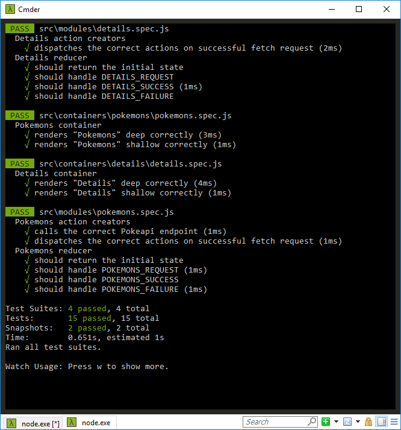

# Pokeapi list

## About me

  - Rodrigo Vallades [rodrigo.vallades@gmail.com]
  - GitHub: https://github.com/rodrigovallades
  - Linkedin: https://www.linkedin.com/in/rodrigo-vallades

## Technologies, techniques and best practices used

- [x] React 16 + Redux 5 + React-Router 4
- [x] ES6 (modules, consts, lets, arrow functions)
- [x] Tests with Jest + Enzyme
- [x] SASS pre-processing
- [x] BEM CSS naming
- [x] Flexbox
- [x] Mobile-first approach
- [x] Bootstrap 4

---
## Getting started

### Prerequisites

Node.js 6+

### Installing
```
npm install
```

### Development (run locally)
```
npm start
```

### Run tests
```
npm test
```
---
## Comments

### You can view the redux store using Redux DevTools Chrome extension


### I prepared a whole suite of tests


### The website is responsive, uses flexbox, atomic CSS (BEM) and is mobile-first


---

# Front-end test assignment

- Create a page to list all `pokemons`
- Create a page to list the `details` of the selected pokemon
- API documentation - https://pokeapi.co/
- API to list `pokemons` - http://pokeapi.co/api/v2/pokemon/
- API to list the `details` of selected pokemon - http://pokeapi.co/api/v2/pokemon/:idDoPokemon/
- When hovering `pokemons`, change the mouse cursor to a hand to indicate that the area is clickable.

Tips:

- Please use Angular or React with Redux.

Evaluation:

- Code structure, CSS, responsiveness, pagination and transition between pages.

Plus:

- Layout and attention to detail.

